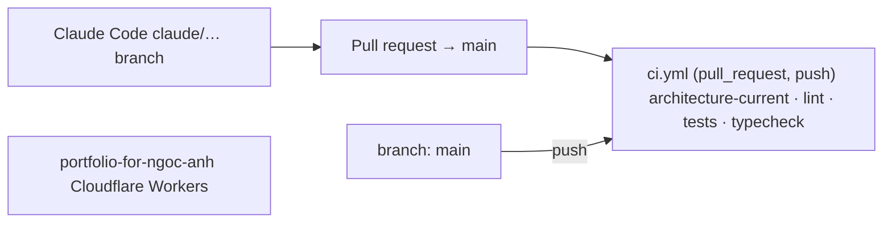
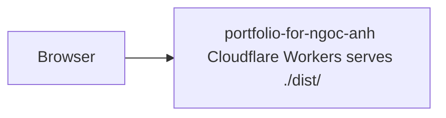

# Architecture

> **Generated file — do not hand-edit.** `scripts/architecture.mjs` draws this
> from the repo's own committed files. To change the picture, change the files
> it reads; the next CI run redraws it. The `architecture-current` job fails if
> this file and the repo disagree.

Derived from **1** workflow file(s), **0** migration(s), and `wrangler.jsonc`.
Nothing here is read from `.claude/scope.json` — that file is gitignored, so CI
cannot see it. Where scope and the repo would disagree, the files are the fact.

## Deploy path

Environments detected: **main only** · branches referenced by workflows: `main`

> ⚠ **No workflow in this repo deploys `portfolio-for-ngoc-anh`.** Nothing here references
> wrangler or the Cloudflare API, so the deploy is happening outside GitHub Actions
> (a platform Git integration, or by hand). The guide's model is that Actions runs
> every deploy — see `docs/02-set-it-up.md` step 8. No edge is drawn for a deploy
> path that does not exist in these files.

## Runtime

## Data

_No `CREATE TABLE` found in `supabase/migrations/`._

## Where each fact came from

| Node | Fact | Source |
|---|---|---|
| ci.yml | jobs: architecture-current · lint · tests · typecheck; on: pull_request, push | `.github/workflows/ci.yml` |
| portfolio-for-ngoc-anh | Cloudflare Workers, build dir ./dist/ | `wrangler.jsonc` |
